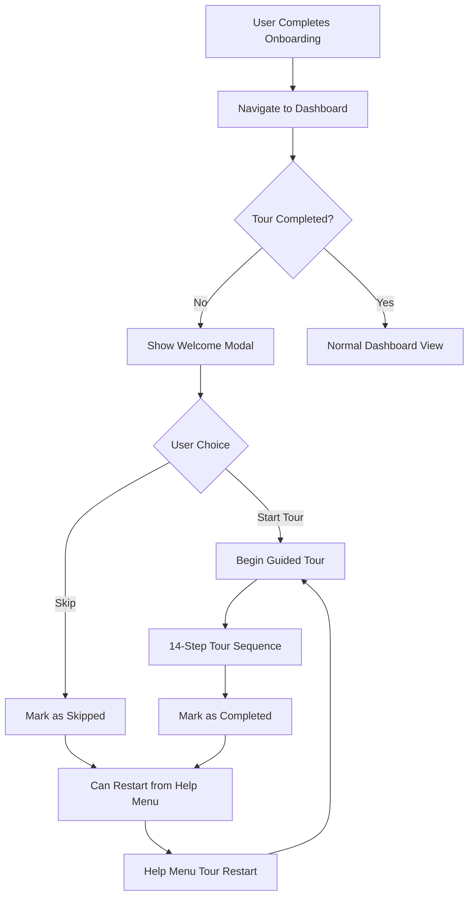

# Design Document

## Overview

The onboarding tour integration system provides a comprehensive guided experience for new users of the BrightRank dashboard. The system consists of three main components: a welcome modal that appears after onboarding completion, an interactive tour using React Joyride, and a help menu for tour management. The design leverages existing components and follows the established design patterns while adding minimal overhead to the application.

## Architecture

### Component Hierarchy

```
App.tsx
├── WelcomeModal (conditional render)
├── DashboardTour (always present, controlled by state)
├── TopBar
│   └── HelpMenu (with tour restart functionality)
├── Sidebar (with data-tour attributes)
└── DashboardPage (with data-tour attributes)
```

### State Management

The tour system uses React state management with the following key states:

- `showWelcomeModal`: Controls welcome modal visibility
- `runTour`: Controls tour execution
- `tourCompleted`: Persisted in localStorage for user preference tracking

### Data Flow



## Components and Interfaces

### 1. WelcomeModal Component

**Purpose**: First-time user greeting and tour initiation

**Props Interface**:
```typescript
interface WelcomeModalProps {
  onStartTour: () => void;
  onSkip: () => void;
  brandName?: string;
}
```

**Key Features**:
- Branded welcome message with user's brand name
- Feature highlights grid (4 key features)
- Clear call-to-action buttons
- Responsive design with mobile optimization
- Backdrop blur and overlay for focus

### 2. DashboardTour Component

**Purpose**: Interactive guided tour using React Joyride

**Props Interface**:
```typescript
interface DashboardTourProps {
  run: boolean;
  onComplete: () => void;
  onSkip: () => void;
}
```

**Tour Steps Configuration**:
- 14 sequential steps covering all major UI elements
- Each step includes contextual content with title and description
- Proper placement positioning (right, bottom, top)
- Custom styling matching brand colors

**Step Sequence**:
1. Sidebar navigation overview
2. Dashboard link explanation
3. Analytics link explanation
4. Keywords link explanation
5. Competitors link explanation
6. Settings link explanation
7. Theme toggle functionality
8. Visibility score card
9. Total mentions card
10. Sentiment breakdown card
11. Date range selector
12. Refresh data button
13. Mentions tracker table
14. Help menu (completion step)

### 3. HelpMenu Component

**Purpose**: Persistent access to tour and support features

**Props Interface**:
```typescript
interface HelpMenuProps {
  onRestartTour: () => void;
}
```

**Features**:
- Dropdown menu with tour restart option
- Additional help resources (documentation, support)
- Visual indicator for first-time users
- Click-outside-to-close functionality

### 4. Enhanced App Component

**New State Variables**:
```typescript
const [showWelcomeModal, setShowWelcomeModal] = useState(false);
const [runTour, setRunTour] = useState(false);
```

**New Methods**:
- `handleStartTour()`: Initiates tour from welcome modal
- `handleSkipTour()`: Handles tour skip from welcome modal
- `handleTourComplete()`: Handles tour completion
- `handleTourSkip()`: Handles tour skip during execution
- `handleRestartTour()`: Restarts tour from help menu

## Data Models

### Tour Step Configuration

```typescript
interface Step {
  target: string;           // CSS selector for target element
  content: React.ReactNode; // Tour step content
  placement: 'top' | 'bottom' | 'left' | 'right';
  disableBeacon?: boolean;  // Disable initial beacon
}
```

### Tour State Management

```typescript
interface TourState {
  showWelcomeModal: boolean;
  runTour: boolean;
  stepIndex: number;
  tourCompleted: boolean;
}
```

### LocalStorage Schema

```typescript
interface TourStorage {
  'brightrank_tour_completed': 'true' | 'skipped' | undefined;
}
```

## Error Handling

### Tour Target Missing
- **Issue**: Tour target element not found
- **Solution**: Graceful degradation, skip to next step
- **Implementation**: React Joyride built-in error handling

### LocalStorage Unavailable
- **Issue**: Browser doesn't support localStorage
- **Solution**: Fallback to session-based tracking
- **Implementation**: Try-catch blocks around localStorage operations

### Component Mount Timing
- **Issue**: Tour starts before target elements are rendered
- **Solution**: Delay tour start with setTimeout
- **Implementation**: 500ms delay when navigating to dashboard

### Responsive Layout Issues
- **Issue**: Tour tooltips don't fit on mobile screens
- **Solution**: Automatic positioning adjustment
- **Implementation**: React Joyride responsive configuration

## Testing Strategy

### Unit Tests
- WelcomeModal component rendering and interactions
- DashboardTour step configuration and callbacks
- HelpMenu dropdown functionality
- LocalStorage utility functions

### Integration Tests
- Complete tour flow from welcome modal to completion
- Tour restart functionality from help menu
- Cross-page navigation during tour
- LocalStorage persistence across sessions

### E2E Tests
- First-time user onboarding to tour completion
- Tour skip and restart scenarios
- Mobile responsive tour experience
- Tour behavior with missing target elements

### Manual Testing Scenarios

1. **First-Time User Flow**:
   - Complete onboarding → Navigate to dashboard → Welcome modal appears → Start tour → Complete all steps

2. **Tour Skip Flow**:
   - Start tour → Skip at any step → Verify localStorage → Restart from help menu

3. **Responsive Testing**:
   - Test tour on mobile, tablet, desktop viewports
   - Verify tooltip positioning and readability

4. **Error Scenarios**:
   - Test with missing tour target elements
   - Test with disabled JavaScript
   - Test with localStorage disabled

## Implementation Considerations

### Performance
- Tour components are lightweight and don't impact initial load
- React Joyride is loaded only when needed
- LocalStorage operations are minimal and non-blocking

### Accessibility
- Tour tooltips include proper ARIA labels
- Keyboard navigation support through React Joyride
- High contrast mode compatibility
- Screen reader friendly content

### Browser Compatibility
- Modern browsers (Chrome 80+, Firefox 75+, Safari 13+)
- Graceful degradation for older browsers
- Mobile browser optimization

### Internationalization
- Tour content is easily translatable
- RTL language support through CSS
- Cultural considerations for tour flow

## Security Considerations

### Data Privacy
- No sensitive data stored in localStorage
- Tour preferences are user-specific and non-sensitive
- No external API calls for tour functionality

### XSS Prevention
- All tour content is statically defined
- No dynamic HTML injection in tour steps
- React's built-in XSS protection

## Styling and Theming

### Brand Integration
- Tour colors match existing brand palette (#6366f1 primary)
- Consistent typography with application fonts
- Dark/light mode support

### Custom Styling
```css
.joyride-tooltip {
  border-radius: 12px;
  padding: 20px;
  font-size: 14px;
}

.joyride-button-next {
  background-color: #6366f1;
  border-radius: 8px;
  padding: 10px 20px;
  font-weight: 600;
}
```

### Responsive Design
- Mobile-first approach
- Tooltip size adjustments for different screen sizes
- Touch-friendly button sizes on mobile devices

## Migration and Rollout

### Deployment Strategy
1. Deploy tour components without activation
2. Enable for beta users first
3. Gradual rollout to all users
4. Monitor completion rates and feedback

### Rollback Plan
- Feature flag to disable tour system
- Fallback to original onboarding flow
- Data cleanup for tour preferences

### Success Metrics
- Tour completion rate (target: >60%)
- User engagement with dashboard features post-tour
- Support ticket reduction for basic navigation questions
- User retention improvement